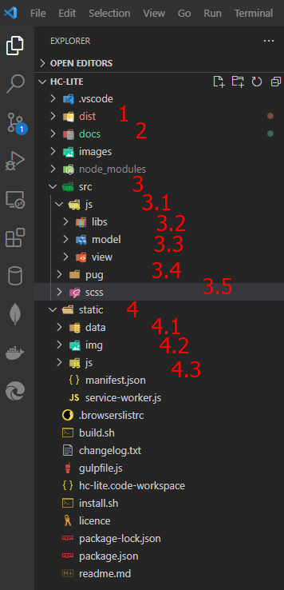

# Hướng dẫn dev chức năng HC-Lite
## I. Giới thiệu
1. Cấu trúc project

- dist: 
    - Chứa các file thành phẩm đã được build: html, css, js, images, ...
    - Dùng để run, test
- docs: Thư mục chứa tài liệu
- src. Source code: Dùng để dev
    - js: Các file Js
        - libs: class thư viện hỗ trợ
        - model: class mô hình dữ liệu
        - view: class xử lý UX
    - pug: File pug để thiết kế UI
    - scss: style giao diện UI
- static: Những file static: không thay đổi
    - data: Chứa dữ liệu tĩnh. VD: sample, json, vv..
    - img: ảnh
    - js: thư viện js không thay đổi

2. Build project
- Run lệnh sau trong terminal: `npm run gulp`

3. Run project
- Install extension [Live preview](https://marketplace.visualstudio.com/items?itemName=ms-vscode.live-server)
- Mở file html, ấn ctrl + shift + p => Show debug preview (external browser)

## II. Design Frontend
- Bước 1: Thiết kế UI
    - Tạo file pug
## III. Dev Backend
