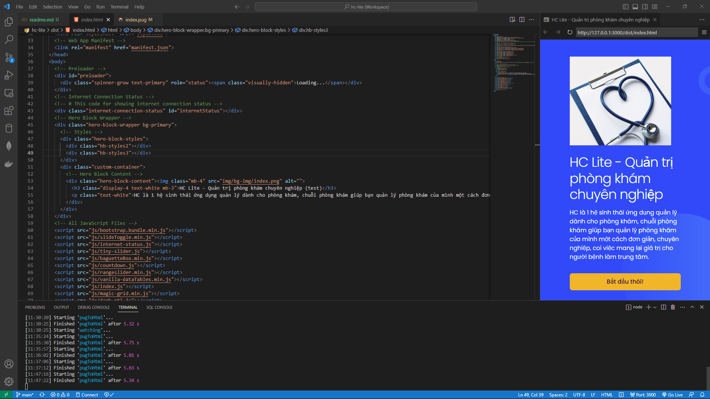

# Code Frontend HC Lite

## Cài đặt môi trường
- Install gulp: mở terminal `npm install -g gulp`
- Install VsCode Extension Live preview
    - Link: https://marketplace.visualstudio.com/items?itemName=ms-vscode.live-server

## Run gulp
## Bước 1:
- Run trong terminal: `npm run gulp`
> Gulp sẽ lắng nghe sự kiện trên file code pug để build thành file html trong thời gian thực

- Log
```
[11:30:25] Starting 'watching'...
[11:35:24] Starting 'pugToHtml'...
[11:35:30] Finished 'pugToHtml' after 5.75 s
```

# Bước 2: Run in browser
- Right click file `index.html` trong thư mục `dist` chọn `Show preview`

# Bước 3: Code
> Code trên file pug, khi có thay đổi Gulp sẽ tự động build sang HTML




